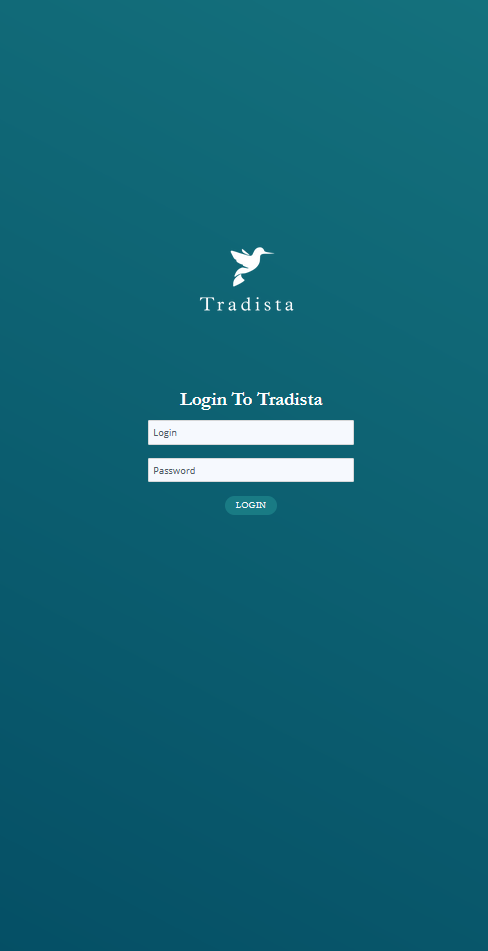
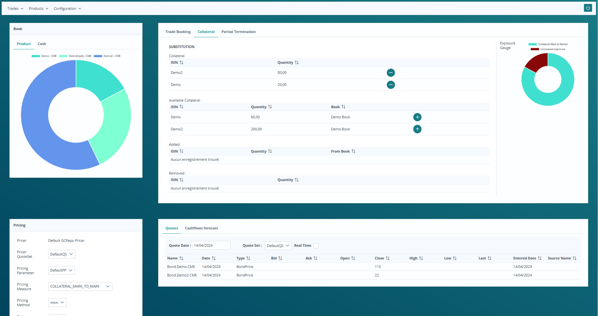

# tradista-demo

This is a demo package for Tradista, available on Windows and Linux/Unix.

This demo package is made of Tradista database, server and desktop client installed locally.
This Tradista environment contains dummy data. A "Demo Book" book is used, with trades of several asset classes being booked.

Start Tradista as follows:

1. Execute startTradistaDB.bat (startTradistaDB.sh on Linux/Unix)
2. Execute startTradistaServer.bat (startTradistaServer.sh on Linux/Unix)
3. Execute startTradistaClient.bat (startTradistaClient.sh on Linux/Unix)

General Collateral Repo (GC Repo) trading Dashboard is web based and can be accessed at http://localhost:8080/web/login.xhtml

A demo of the Equity trading web based dashboard can be tested at http://localhost:8080/web/loginDemo.xhtml

You can connect using the login/pwd: test/test

Feel free to request features or report bugs on [tradista repository](https://github.com/oasuncion/tradista).
If you see missing useful data on this demo environment, feel free to request it on [tradista-demo repository](https://github.com/oasuncion/tradista-demo).

This demo is packaged using [Install4J](https://www.ej-technologies.com/products/install4j/overview.html).

|||
|:-:|:-:|
| Login Page | Trading Dashboard |

