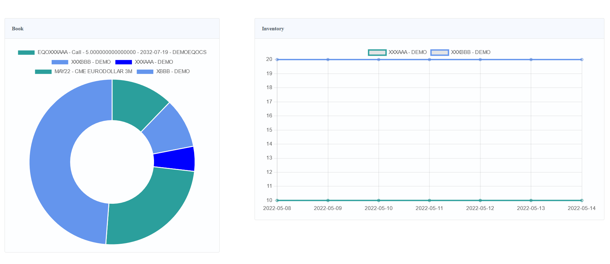

# tradista-demo

This is a demo package for Tradista.

This demo package is made of Tradista database, server and desktop client installed locally.
This Tradista environment contains dummy data. A "DemoBook" book is used, with trades of several asset classes being booked.

Start Tradista as follows:

1. Execute startTradistaDB.bat
2. Execute startTradistaServer.bat
3. Execute startTradistaClient.bat

For a demo of the Web GUI (Only Equities), go to http://localhost:8080/web/login.xhtml

You can connect using the login/pwd: test/test

Feel free to request features or report bugs on [tradista repository](https://github.com/oasuncion/tradista).
If you see missing useful data on this demo environment, feel free to request it on [tradista-demo repository](https://github.com/oasuncion/tradista-demo).

